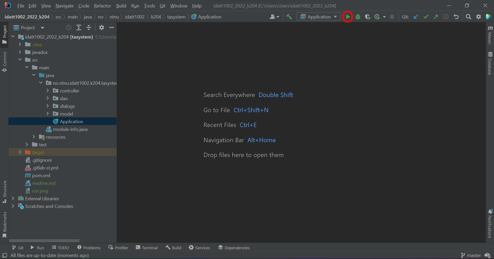

<h1>Tournament Administration System</h1>

This is a group project in IDATT1002-System Development. The Tournament Administration System (TAS) is a program developed for NTNUI e-sport to make the process of managing e-sports tournaments easier and more efficient.

## Opening the project
To open the project, you first need IntelliJ IDEA by JetBrains and a Java SE Development Kit from Oracle. 
Once you have these installed, you can open the project folder called `idatt1002_2022_k204_code` from the 'File' menu 
in IntelliJ IDEA.

## Running the application
To run the application, locate the green play button next to the Run/Debug Configuration selector at the top of the 
window (highlighted in picture below). Make sure that `Application` is the selected run configuration in the drop-down menu.
If it is not selected or there are no configurations added, navigate to `src/main/java/no.ntnu.idatt1002.k204.tasystem`, 
right-click the file `Application` and select `Run 'Application.main()'`. 

## Regarding log in
Note that it is currently not possible to log into the application because the database was shut down after the project period. 
However, the user manual included in the repository may be read to understand the application further.
